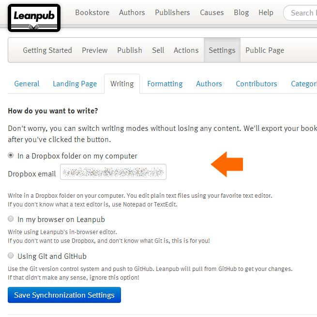

LeanPub Magic
=============

**Helper scripts for publishing via LeanPub using DropBox *and* a non-Github Git repo.**

Purpose
-------
LeanPub (https://leanpub.com/) is an excellent lean publishing platform with useful APIs. LeanPub has integration with both Github and Dropbox for storing book content.

However, if you want to use a non-Github Git repo (for all the nice `git log` goodness), but still want the simplicity of Dropbox integration for generating previews and for publishing, then **LeanPub Magic** is for you. 

Details
-------

On the *Settings > Writing* page of your LeanPub book, for the *How do you want to write?* option choose "In a Dropbox folder on my computer":

- `LeanCopy`: copies files from the local Git repo to the local LeanPub Dropbox directory *if* the files in Git are newer than those in Dropbox (avoids accidents)
- `LeanPreview`: triggers a book preview generation (async)
- `LeanStatus`: checks the progress (status) of a preview operation 

On Linux/Mac the scripts are `*.sh` and on Windows the scripts are `*.cmd`. The scripts behave identically on both platforms.

Setup
-----

There are four environment variables that you need to set before the LeanPub Magic scripts will work:

  1. LEANPUB\_BOOK\_NAME - the name of the LeanPub book as used in the LeanPub URL: e.g. for [https://leanpub.com/mybook](https://leanpub.com/mybook), the name is 'mybook'
  1. LEANPUB\_GIT\_DIR - the path to the directory within the local Git repo that contains the LeanPub 'manuscript' directory
  1. DROPBOX\_DIR - the path to the top-level local Dropbox directory (containing the Dropbox shared folder called LEANPUB\_BOOK\_NAME)
  1. LEANPUB\_API\_KEY - your LeanPub API key (find this at [https://leanpub.com/dashboard/account](https://leanpub.com/dashboard/account))
  
Of these, LEANPUB\_API\_KEY and DROPBOX\_DIR are likely to remain constant across multiple books, whereas the other variables will likely change for different books. This allows you to author more than one book using the same LeanPub Magic scripts with minimal reconfiguration - you just need to update LEANPUB\_BOOK\_NAME and LEANPUB\_GIT\_DIR when switching to work on a new book.

During script execution, these variables are checked for sane values; the scripts exit if the variables are not set.

You probably want to add the `scripts` subdirectory to your PATH to make the scripts easier to run.

Workflow
--------

The combination of Git for version control and Dropbox for publishing control is powerful, especially for multi-author books. The general suggested workflow is:

  1. Use Git to make changes to the book content. Iterate here until you are ready to generate a preview (LeanPub knows nothing of our Git repo, which means that no intermediate previews are generated).
  1. When you are ready to generate a preview, run the *LeanCopy* script to copy the files from Git to the local Dropbox directory. This triggers an upload to the shared LeanPub Dropbox.
  1. When the Dropbox upload has completed, run the *LeanPreview* script, which triggers a preview generation; the `curl` call returns immediately.
  1. If required, run the *LeanStatus* script repeatedly in order to track the progress (status) of the preview generation. When the preview generation has completed, *LeanStatus* returns an empty JSON object.

Put simply, when you want to generate a new Preview, you run: `LeanCopy`, then `LeanPreview`, and then optionally `LeanStatus`.
  
Note: a script to automatically trigger a *Publish* of the book has not been included here, as a publish operation is probably best left as a manual thing via the browser.  

Example: Linux/Mac
------------------

Clone the leanpubmagic repo into a suitable location, and ensure the .sh file are executable, use chmod as necessary. 

Setup the env vars:

export LEANPUB_BOOK_NAME=myleanpubbook
export LEANPUB_GIT_DIR=/Users/rob/git
export LEANPUB_API_KEY=ii3434lr34lktj3ltkj
export DROPBOX_DIR=/Users/rob/Dropbox

After you latest edits, and git commit, Copy the files to dropbox, run:

$./LeanCopy.sh

After the copy operation successfully comples, you can start a preview generation, run:

$LeanPreview.sh

Checking on preview generation progress can be done by running:

$LeanStatus.sh

Example: Windows
----------------

Setup the env vars:

`C:\>set LEANPUB_BOOK_NAME=myleanpubbook`

`C:\>set LEANPUB_GIT_DIR=C:\Data\Git\myleanpubbook`

`C:\>set DROPBOX_DIR=C:\Users\Me\Dropbox`

`C:\>set LEANPUB_API_KEY=uu89mkwlmlkckewl4839`

`set path=%path%;C:\Data\Git\leanpubmagic\scripts`

Copy the files from Git to Dropbox:

	C:\>LeanCopy
	
	C:\>xcopy /d /i /e /y C:\Data\Git\myleanpubbook\manuscript C:\Users\Me\Dropbox\myleanpubbook\manuscr
	ipt
	C:\Data\Git\myleanpubbook\manuscript\Book.txt
	C:\Data\Git\myleanpubbook\manuscript\Sample.txt
	2 File(s) copied

Trigger a Preview operation:

	C:\>LeanPreview
	
	C:\>curl -d "api_key=uu89mkwlmlkckewl4839" "https://leanpub.com/myleanpubbook/preview.json"
	{"success":true}`

Check the status of the Preview operation:

	C:\>LeanStatus
	
	C:\>curl "https://leanpub.com/myleanpubbook/book_status?api_key=uu89mkwlmlkckewl4839"
	{"time":1402523233,"status":"working","options":{"slug":"myleanpubbook","action":"preview","email_re
	aders":false,"requested_by":"email@domain.com","provenance":"api"},"name":"Preview myleanpubbook","m
	essage":"Generating PDF","job_type":"GenerateBookJob#preview","hide_from_author":false,"num":14,"tot
	al":28}`

Pre-requisites
--------------

- The scripts use `curl` to talk to the LeanPub API. On Windows, you probably have `curl` through your Git tools, but if not, simply install Git bash from [http://git-scm.com/download/win](http://git-scm.com/download/win) - `curl` comes with Git bash.
- You will also need a Dropbox client installed locally, and a Dropbox account wired up to LeanPub (see [https://leanpub.com/help/getting_started_sync_dropbox](https://leanpub.com/help/getting_started_sync_dropbox) for details).

TODO
----

  1. Actually check the env vars before running the scripts (!).
  1. Document a worked example for Linux/Mac
